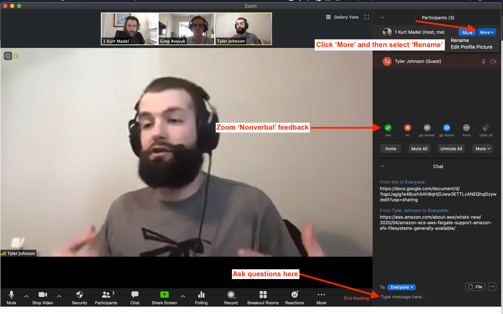
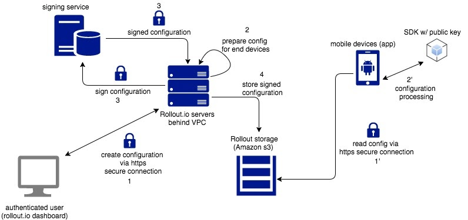

name: rollout-title-slide
class: title, shelf, no-footer, fullbleed
background-image: linear-gradient(135deg,#279be0,#036eb4)
count: false

# CloudBees Feature Management Workshop

???
This workshop introduces attendees to the features for CloudBees Rollout.

---
layout: true

.header[
]

.footer[
- © 2021 CloudBees, Inc.
- 
]
---
name: agenda
# Agenda

1. CloudBees Feature Management Workshop Setup
2. Adding a Title to the Microblog
3. Controlling the Value of a Feature Flag
4. User Targeting
5. CloudBees Feature Management Configuration as Code
6. Analytics and A/B testing

.footnote[.bold[*] Please note, we may not get through all the material during the workshop today. However, all of the lab material is freely available and can be self-led. The CloudBees CI lab environment will be available until next Monday and the CloudBees Feature Management trial is available for 14 days if you would like to complete any labs we don't finish today.]

---
name: workshop-tools
# Workshop Tools Overview

* We highly recommend using Google Chrome as the web browser - other browsers will work, but we have found Chrome to have the best *Developer* tools for the labs.
* We will be using Zoom breakout rooms for the majority of the workshop material.
* Please use the Zoom chat to introduce yourself and if you have any questions.
* We will be grouping attendees in Zoom breakout rooms based on if you did the CloudBees CI workshop just before this one. If you did the CloudBees CI workshop rename yourself in Zoom by adding the number **1** before your name.
* After an overview of CloudBees Feature Management you will be grouped into Zoom breakout rooms where you will complete the workshop.
* Once in the breakout rooms please feel free to ask questions via audio or via the Zoom chat. You may also use the Zoom *Nonverbal* feedback feature to raise your hand or to ask you instructor to slow down or speed up. NOTE: The chat is only broadcast to your breakout room.

---
name: workshop-zoom
class: center

---
name: rollout-lab-environment
# Lab Environment

* This workshop uses CloudBees Feature Management SaaS version running on AWS
  * Each attendee will sign up for a CloudBees Feature Management account
  * If you are already a CloudBees Feature Management customer, simply sign in as usual
* This workshop also will use a CloudBees CI cluster, an enterprise version of Jenkins, running on the Google Kubernetes Engine (GKE) to provide automated build and deploy for everyones' sample applications
  * Each attendee will provision their own ***managed controller*** (team specific Jenkins instance) for the labs by leveraging the scalability of CloudBees CI on Kubernetes
* All the instructions for the labs and these slides are publicly available in GitHub
* Attendees will be using their own GitHub accounts
* A portion of this workshop requires using your web browser's developer tools, we recommend Chrome

---
name: rollout-overview-title
class: title, shelf, no-footer, fullbleed
background-image: linear-gradient(135deg,#279be0,#036eb4)
count: false

# CloudBees Feature Management Overview

---
name: feature-flag-background
class: compact

# What is Feature Flagging?

At its most simplistic, feature flagging is a practice of wrapping new functionality in conditional code blocks.
 
 
Feature flags are used to hide, enable or disable features during runtime. With Feature Management, a software feature can be tested even before it is completed and ready for release.  For example, during the development process, a developer can enable the feature for local testing and disable it for all other users. Feature flagging also provides an alternative to maintaining multiple feature branches in source code.
 
 
This technique offers many other benefits and will be discussed in greater detail in this workshop.

---
name: rollout-overview-content

.italic[
  *95% of respondent's organizations have implemented, begun implementing, or plan to implement Feature Management in the future* - Atlassian / CloudBees Feature Management market research report 2018
]

# Feature Flag Management
* Costly, Manual, Development Headaches
* Risk in Testing and Production
* Slow Time to Market
* Non-granular, Inflexible
* Need for Experimentation & Innovation

---
name: rollout-overview-value

# CloudBees Feature Management Solution

.italic[
*CloudBees Feature Management is a multi-platform, Infrastructure as Code,
SaaS feature management and remote configuration solution.*
]

Faster Delivery
.no-bullet[
* Don’t wait for a feature to trickle out across multiple servers in a highly scaled application; turn it on all at once when it’s ready, or selectively enable it for users.
]

Safer Releases
.no-bullet[
* Test new code  safely in production with blue/green and canary deployments. If a bug is discovered, just turn off that feature right away and then repair it.
]

Experimentation
.no-bullet[
* Determine the impact of a feature on your revenue, user engagement, etc. Enable features only for your QA team to allow validation with production data.
]

Customization
.no-bullet[
* Turn specific features on or off for particular customers, based on preferences, location, licensing, etc.
]

---
name: rollout-overview-architecture
class: middle, center

# CloudBees Feature Management Flag Update Process

???
Starting from dashboard on bottom left, we process configuration on the CloudBees Feature Management server to generate a JSON config file and we sign that JSON file with a public and private key and save the file to a cloud service, specifically amazon s3.

And then the Client side SDKs (mobile, web, backend service etc) download that JSON file so all the processing and all the decision points happen on the target device itself.

The entire architecture is stateless, for 2 main reasons
1. privacy and security: we do not want you to share your user info with us. All we know are experiment names, target group names, Feature Management name, but we do not know user information.
2. we want to ensure there is no impact to your services. Even if we have an outage and our servers are down, at maximum you will not be able to make a configuration change via the dashboard. Your service will not be impacted because at the end you are just reading a JSON file. We also try to mitigate service issues during network outages because our Feature Management always have default values, we also use local caching on the device and other mechanisms to ensure there is no impact if CloudBees Feature Management has a problem.

Lastly, we are using Server sent event protocol to notify the SDKs that they need to download a JSON file when there is a change in the dashboard. The idea is to ensure that every change to the dashboard is received as fast as possible on the end devices.
