---
title: "Adding deployment to release"
chapter: false
weight: 6
--- 

So far you've created a release, an application model, and two environment models. Now it is time to tie these all together.

You've got the deployment automation part working, you can successfully deploy the application. But being able to deploy the application is only half of the situation. You're not going to want to manually click **Deploy** on the application when there is a new version.

With the **release** being the main orchestrator which maps your software release process, this is where you'll introduce the application deployments into an automated process.

## Replacing the mocked steps

First let's get back to our release. You can navigate to it by opening the "burger menu" in the top left and clicking on the **Release Orchestration > Releases** item.

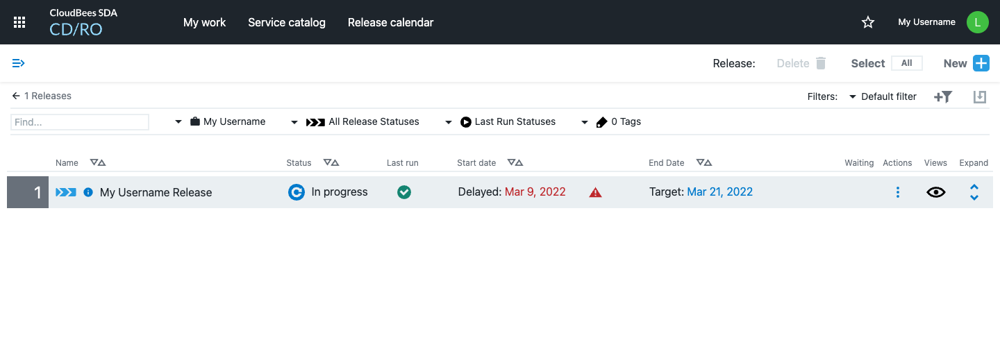

Recall that our **Deploy to QA** and **Deploy to Production** tasks are just mocked out deployments at the moment. All they do is run an echo command.

### Updating the QA stage

Let's start by replacing the task in the **Quality Assurance** stage. To do this, click on the task and then click on the trash can icon above it. 
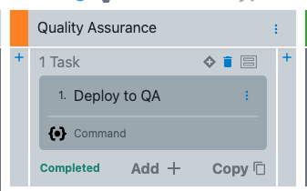
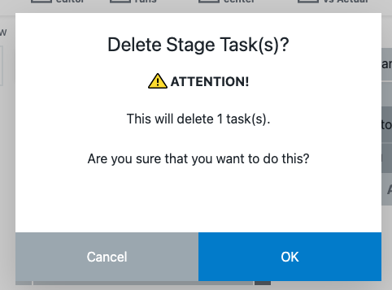

_Alternatively, you can delete tasks by clicking on the "more" menu on the task and click the delete item._
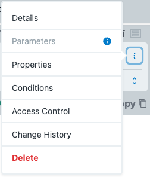

Which ever way you deleted it, you should now see 0 Tasks in that stage.
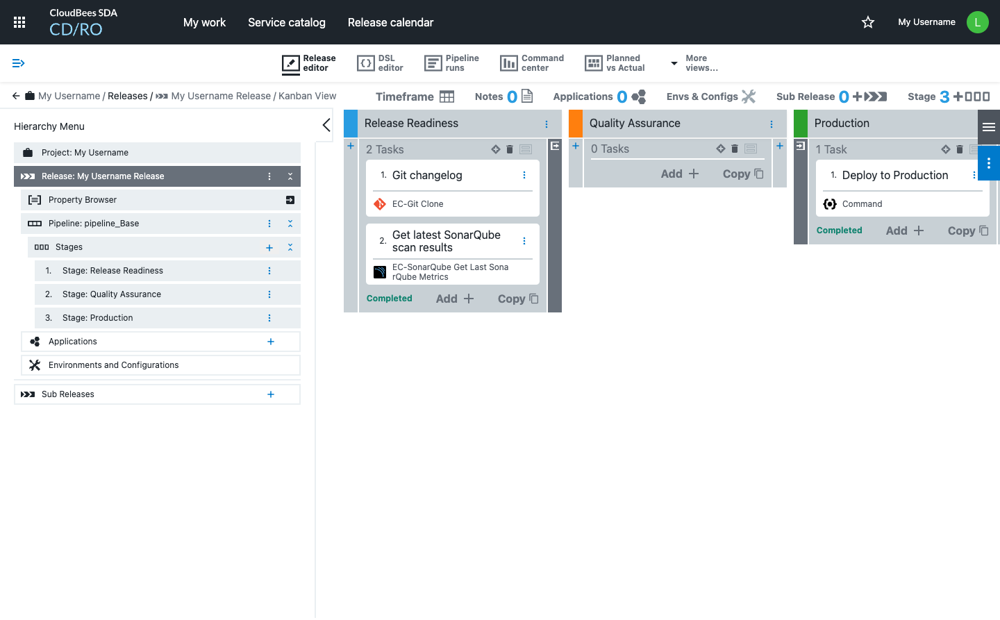

Now it is time to create a new task. Go ahead and click the **Add** button in the bottom of the stage. Go ahead and call it `Deploy to QA`.

Next, click on **Select Task Type** and choose the **Deployer** option from under the **Native** section.

Then, click on **Define** to configure this task.
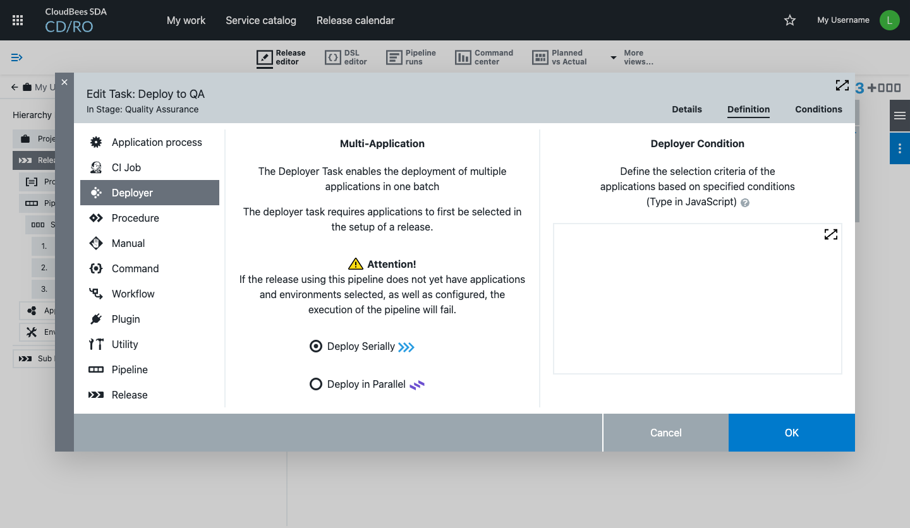

Since we're only working with a single application, we can ignore these settings and just click **OK**. This is where you can change the behavior of how it chooses to deploy multiple applications.

Now we're done with the QA stage.

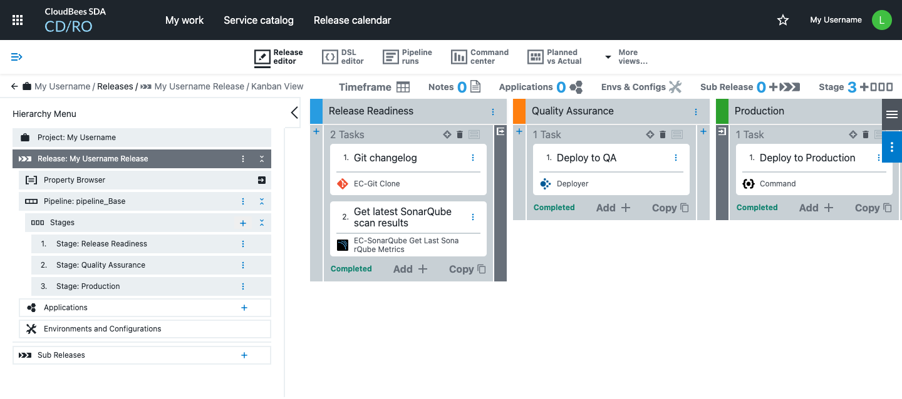

### Updating the Production stage

Go ahead and run through the same steps from the **Updating the QA stage** section in the **Production** stage. The only change you'll need to make is to call it `Deploy to Production` instead of `Deploy to QA`.

By the end of it you should have both stages updated with these **Deployer** steps.

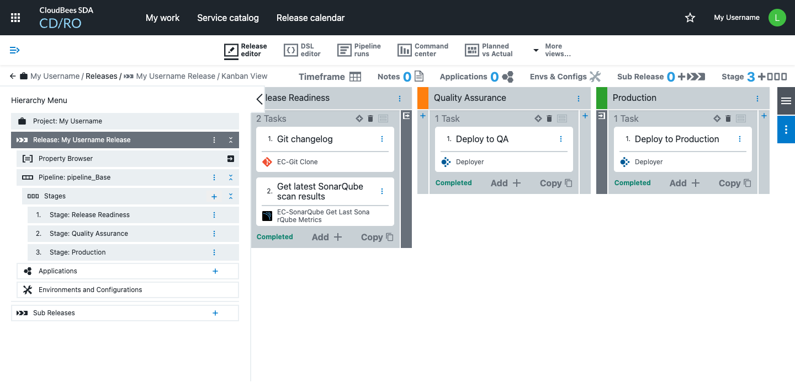

## Mapping applications and environments
You probably noticed that those **Deployer** steps didn't actually specify anything about our application or environments. 

Does it automatically figure out which environment based on the stage name?

No, we believe it is better to be explicit. Anything that relies on a particular convention like this would be brittle and error-prone.

What we need to do is tell this release which applications and environments to map to which stages.

Over on the left-side of the release page you'll see the **Hierarchy Menu**. Towards the bottom you'll see the **Applications** and **Environments and Configurations** items. We'll be using both of these.

### Mapping the application
Let's start by mapping the application to the release. Go ahead and click on the **Applications** button. 

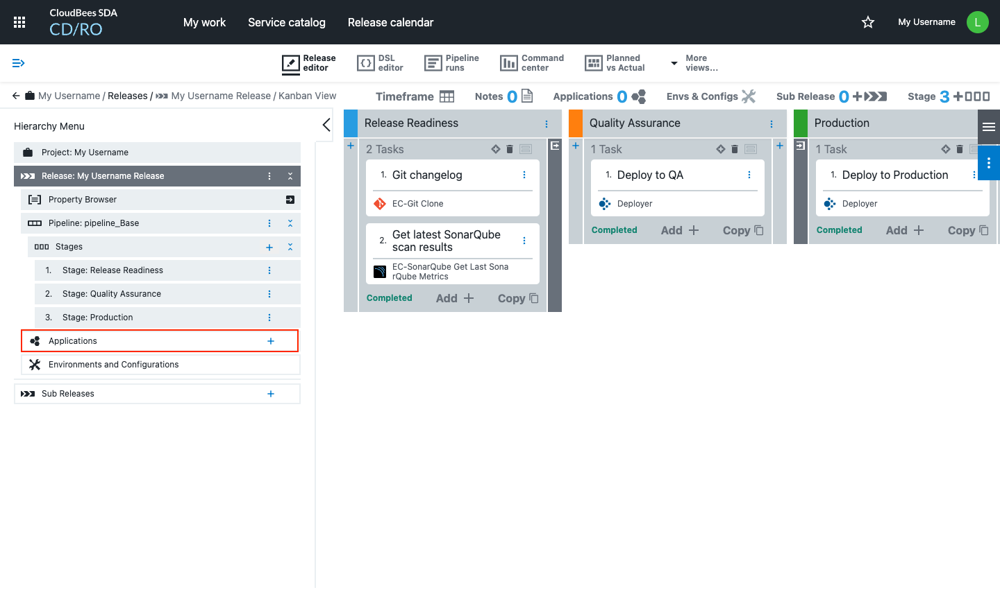

To map the application to this release, you need to:

1. Select your specific application (make sure it is the one that matches your project)
2. Click the blue button to assign it to the release
3. Close the application selector
4. Click **OK** to save it
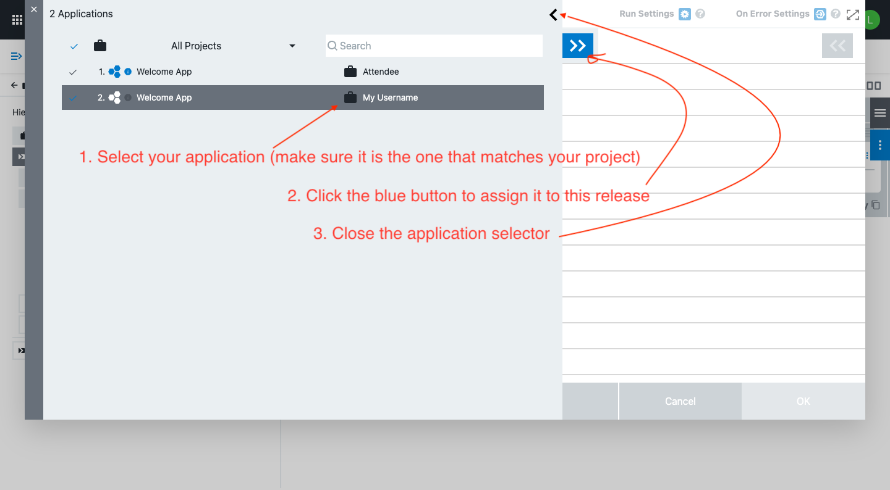

_Note that the application selector is a multi-select, so you can assign multiple applications to a given release. We're just using one, but you could deploy hundreds of applications if you wanted._

As easy as that, your application is now mapped to the release. Next up is assigning environments.

### Mapping Environments and Configurations
Now, go ahead and click the **Environments and Configurations** button.

_Note that you should now see **1 Application** in the box above it. If you don't, you'll want to click into it and make sure that the application from the previous section was saved._

Here you'll see that it recognizes the **Deploy to QA** and **Deploy to Production** tasks that you've created. 

#### Mapping the QA stage

Go ahead and click on the **Quality Assurance** block. 

Then click on the **Environment** button in the top right. This will open up a modal where you can select the environment. By default it'll be on Name Pattern, but you'll want to switch to **Select Environment**. Then go ahead and select the **QA** environment that corresponds to your project. Then hit **OK**.
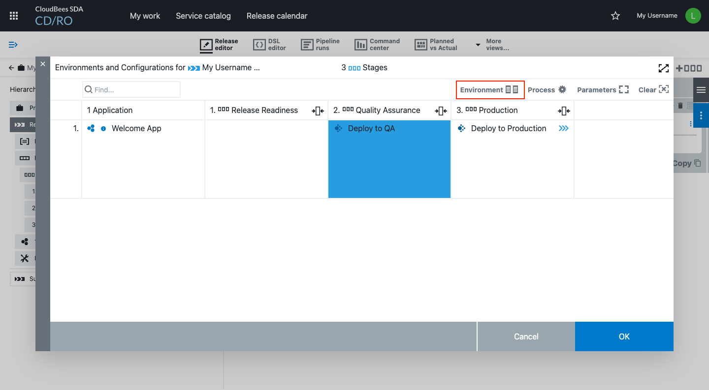

Next, with the QA environment still selected, click on the **Process** button in the top right. This will open a modal which will allow you to choose the application process for your **Welcome App**. There should only be one option, **Deploy Application**. Go ahead and select it and then hit **OK**.
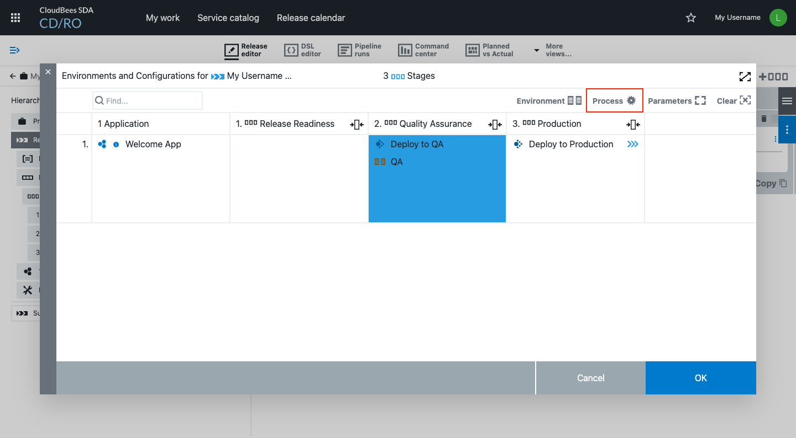

You'll notice there is also a **Parameters** button available. For this application deployment we aren't using any parameters, but rather using environment variables, so we don't need to use these.

#### Mapping the Production stage
Now go ahead and perform the same steps from **Mapping the QA stage** for the **Production** stage. You'll need to target the Production environment instead of the QA environment.
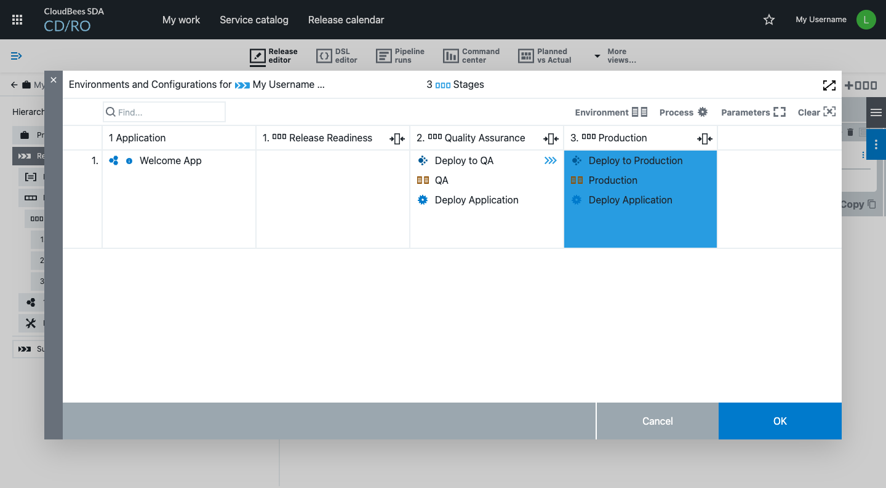

And with that, you've configured everything needed for these deployments to be part of the release.

## Running the release
While nothing in the application has changed, it would be a shame after going through all those configurations to not kick it off.

Go ahead and click the **Run pipeline** option from the floating blue button on the right-side of the page. Leave the default options so that it will run across all three stages. Then click **Run**.

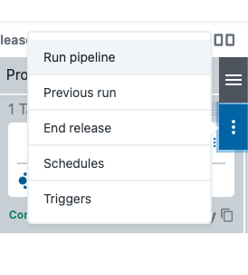
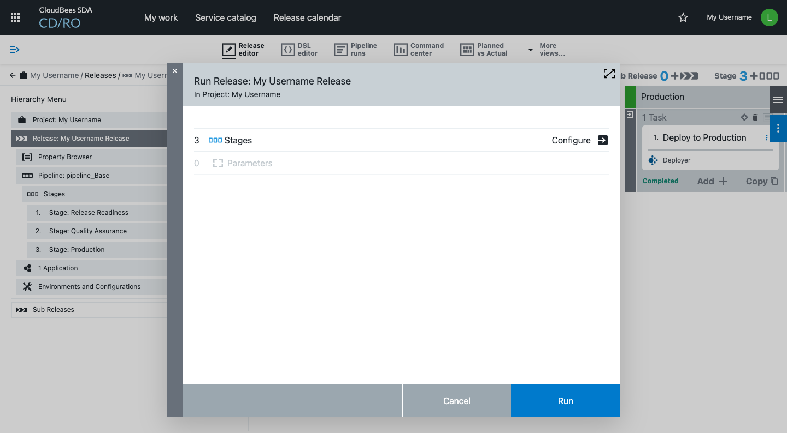
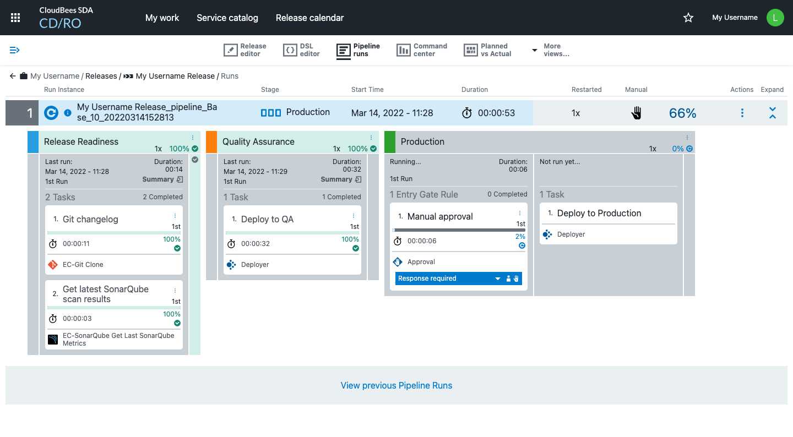
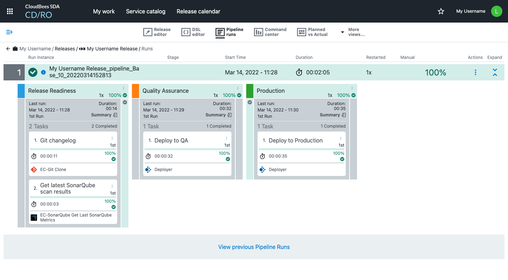

And there you have it, your release successfully deployed. The live applications haven't changed since no changes were made to the code, but here you can access them again if you'd like to verify.

Before, when we were looking at the audit reports, the deployments were empty since we hadn't done any yet. Now if you go back there you can see that those details are showing up. (You can access the audit report by going to **Actions > Audit Report > Deployments** on the release run) 
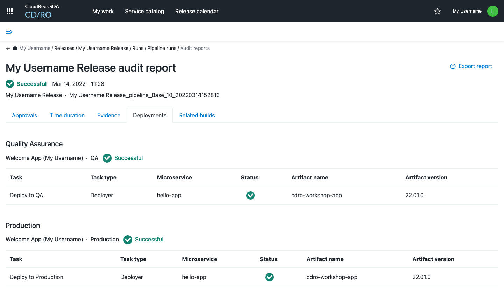

## Up next
In this lab you updated your release to actually perform the application deployments. Next up we'll look at how you can take this release pipeline and turn it into a self-service catalog item.

